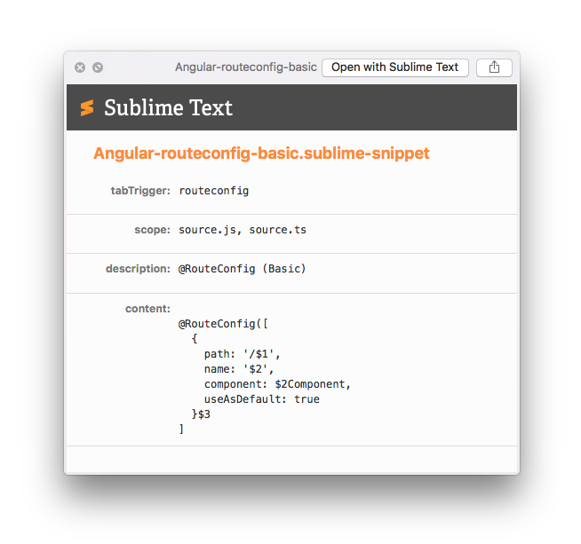

# SublimeSnippetQL  
QuickLook Plugin for sublime-snippet and tmSnippet (updated).

# Download  
Binary is here <http://hetima.com/tmp/SublimeSnippetQL.zip>
Note: This binary is the original one hosted on hetima.com and does not include the changes introduced in this fork.

# Install  
- place into  <code>~/Library/QuickLook</code>.
- exec <code>qlmanage -r</code> if needed.

#License
MIT License  
(C)2013 hetima.
